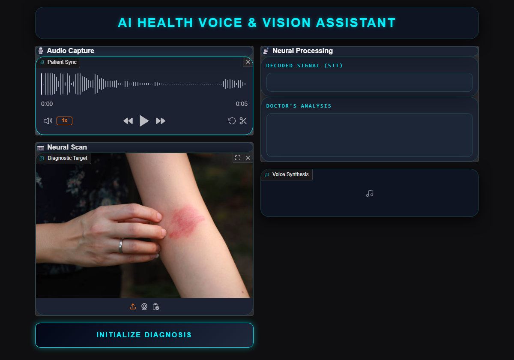
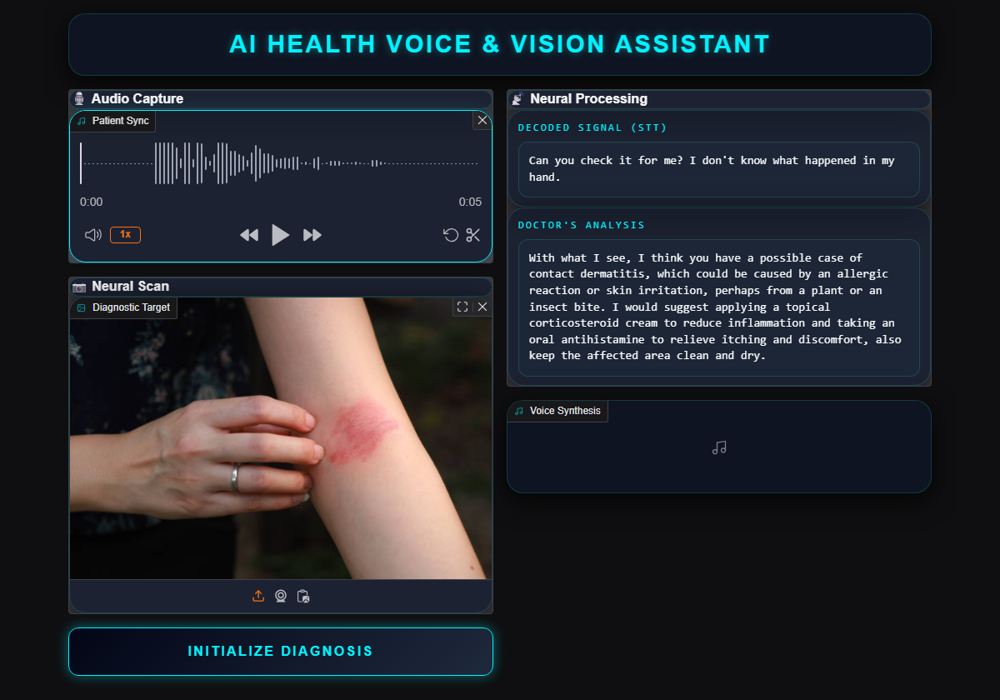
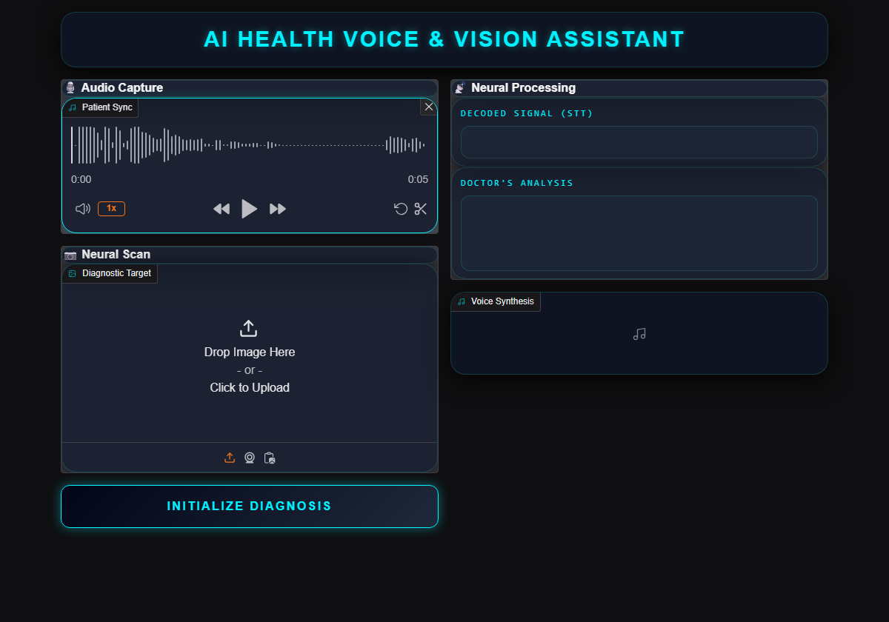
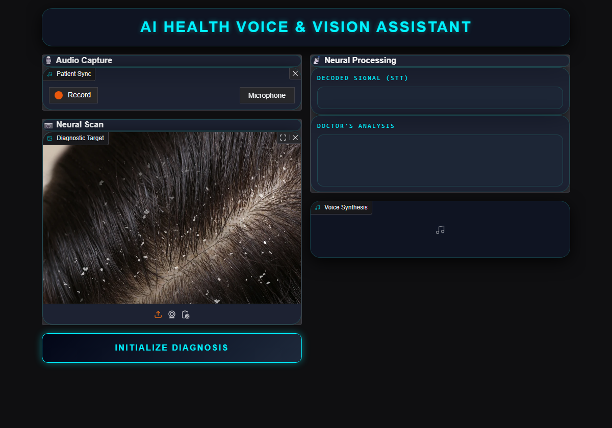
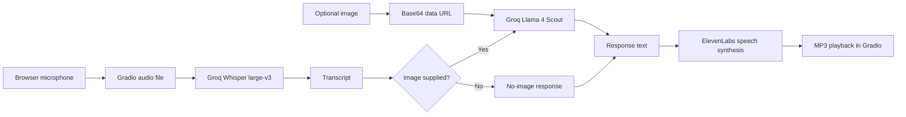

# AI Medical Voice & Vision Assistant

A Gradio prototype that accepts a spoken question and an optional image, transcribes the audio, generates a context-aware response when an image is supplied, and reads the response aloud. It is a learning project for a multimodal inference workflow, not a clinically validated diagnostic tool.



*The current interface with a recorded question and a skin image ready for processing.*

**Explore:** [Project showcase](#project-showcase) · [How it works](#how-it-works) · [Technology stack](#architecture-and-technology-stack) · [Getting started](#getting-started) · [Engineering notes](#engineering-notes)

## Project showcase

### Saved analysis



*An archived local run displayed in the current interface. The transcript and response are the exact saved values; the read-only text areas were expanded for legibility. This image does not represent a new model call.*

| Voice capture | Image input |
| --- | --- |
|  |  |
| A recorded patient question can be reviewed before submission. | The same image input accepts different visual cases. |

[View all seven screenshots](ai-doctor-2.0-voice-and-vision-main/portfolio-images/).

## What the application does

- 🎙️ **Voice input:** Captures microphone audio through Gradio and transcribes it with Groq-hosted Whisper `whisper-large-v3`.
- 🖼️ **Image analysis:** When an image is provided, combines the transcript with a prompt and sends the image to Groq's `meta-llama/llama-4-scout-17b-16e-instruct` vision model.
- 🔊 **Spoken response:** Displays the transcript and response, then synthesizes the response with ElevenLabs for audio playback.
- **Input behavior:** Audio is required. Without an image, the app returns a fixed no-image message and still synthesizes that message.

The app does not keep a conversation history or make a medical diagnosis that has been independently verified.

## How it works



1. `gradio_app.py` receives file paths from the microphone and image components. The callback rejects an empty audio input before calling any external service.
2. `voice_of_the_patient.py` sends the audio file to Groq for English transcription.
3. For an uploaded image, `brain_of_the_doctor.py` Base64-encodes the file and sends it with the transcript to the vision model. Without an image, the callback uses its fixed fallback response.
4. `voice_of_the_doctor.py` requests ElevenLabs speech synthesis. Gradio displays the transcript, response, and returned MP3 path.

## Architecture and technology stack

| Component | Responsibility | Technology |
| --- | --- | --- |
| `gradio_app.py` | UI, input validation, workflow orchestration, response prompt | Python, Gradio Blocks, custom CSS |
| `voice_of_the_patient.py` | Groq transcription; includes a separate local recording helper | Groq SDK, Whisper, SpeechRecognition, pydub |
| `brain_of_the_doctor.py` | Image encoding and multimodal request | Groq SDK, Base64 data URL |
| `voice_of_the_doctor.py` | Spoken response returned as a file path | ElevenLabs `eleven_turbo_v2` with the `Aria` voice; gTTS helpers are present but are not used by the Gradio workflow |

The repository pins Python 3.11 in `Pipfile` and includes both `requirements.txt` and `Pipfile.lock`. The Gradio application is launched from `gradio_app.py`; there is no `app.py` entry point.

## Getting started

### Prerequisites

- Python 3.11 and a browser with microphone access.
- A Groq API key for transcription and image analysis.
- An ElevenLabs API key for synthesized speech.

Clone the repository and enter the application directory:

```bash
git clone https://github.com/vinayak533/AI-Medical-Voice-Vision-Assistant.git
cd AI-Medical-Voice-Vision-Assistant/ai-doctor-2.0-voice-and-vision-main
python --version  # Confirm Python 3.11
```

Create a virtual environment and install the pinned dependencies:

```bash
python -m venv .venv
# macOS/Linux: source .venv/bin/activate
# Windows PowerShell: .\.venv\Scripts\Activate.ps1
python -m pip install -r requirements.txt
```

`PyAudio` is included for the separate local recording helper and may require PortAudio build dependencies on some systems. The Gradio UI itself records through the browser.

Create a `.env` file in this application directory:

```dotenv
GROQ_API_KEY=your_groq_api_key
ELEVEN_API_KEY=your_elevenlabs_api_key
```

The ElevenLabs variable is named `ELEVEN_API_KEY` in the code. Keep `.env` out of commits and avoid using identifiable patient data: audio, images, and response text are sent to external services.

Run the interface:

```bash
python gradio_app.py
```

Open the local URL printed by Gradio, usually `http://127.0.0.1:7860`. Record a question, optionally add an image, and select **INITIALIZE DIAGNOSIS**. The external API calls require network access and valid keys.

## Repository layout

```text
AI-Medical-Voice-Vision-Assistant/
├── README.md                              # Repository overview
└── ai-doctor-2.0-voice-and-vision-main/
    ├── gradio_app.py                      # UI and callback
    ├── brain_of_the_doctor.py             # Vision model request
    ├── voice_of_the_patient.py            # Transcription and recording helper
    ├── voice_of_the_doctor.py             # Speech synthesis
    ├── requirements.txt                   # Pinned pip dependencies
    ├── Pipfile / Pipfile.lock              # Python version and lockfile
    ├── portfolio-images/                  # Project screenshots
    └── *.jpg, *.webp                       # Sample images
```

## Engineering notes

- **Clear integration boundaries.** The UI callback delegates transcription, image analysis, and speech synthesis to separate modules, keeping the main request path easy to follow.
- **File-path handoff.** Gradio supplies paths for recorded audio and uploaded images; the TTS helper returns a path that Gradio can play directly.
- **Explicit image branch.** An image is optional, while audio is required. The no-image path returns a deterministic response without calling the vision model.
- **Current limits.** The generated audio is written to the fixed path `final.mp3`, so concurrent requests may overwrite one another. There is no authentication, persistence layer, automated test suite, clinical validation, or production data-handling policy. Treat this as a local demonstration.
- **Image format caveat.** The vision helper labels its data URL as JPEG regardless of the uploaded file's actual format. The UI can display other image formats, but their model behavior has not been verified.

## Development and contributions

Keep changes focused on the existing workflow and document any new external service or environment variable. Before opening a pull request, run the app locally and exercise microphone capture, image upload, the no-image path, and playback. Add tests for new logic where practical; none are configured today. Never commit API keys or patient data.

Issues and pull requests are welcome, especially for test coverage, safer output-file handling, accessibility, and clearer error reporting.
