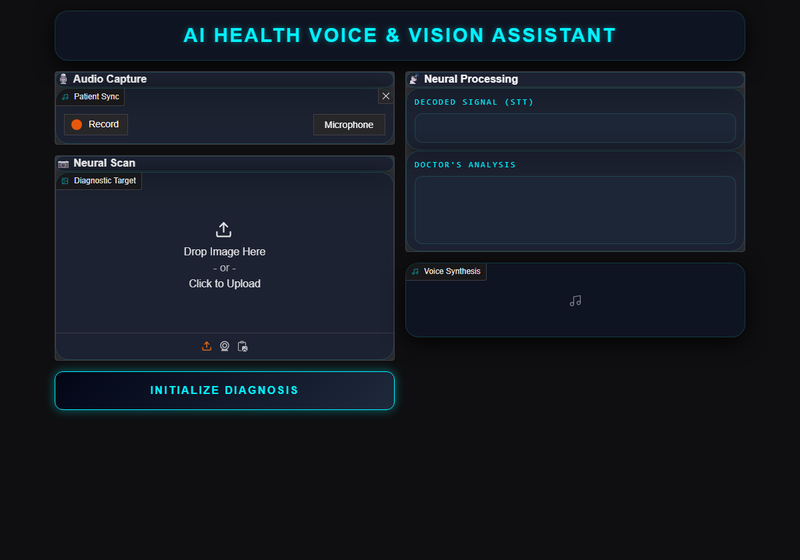
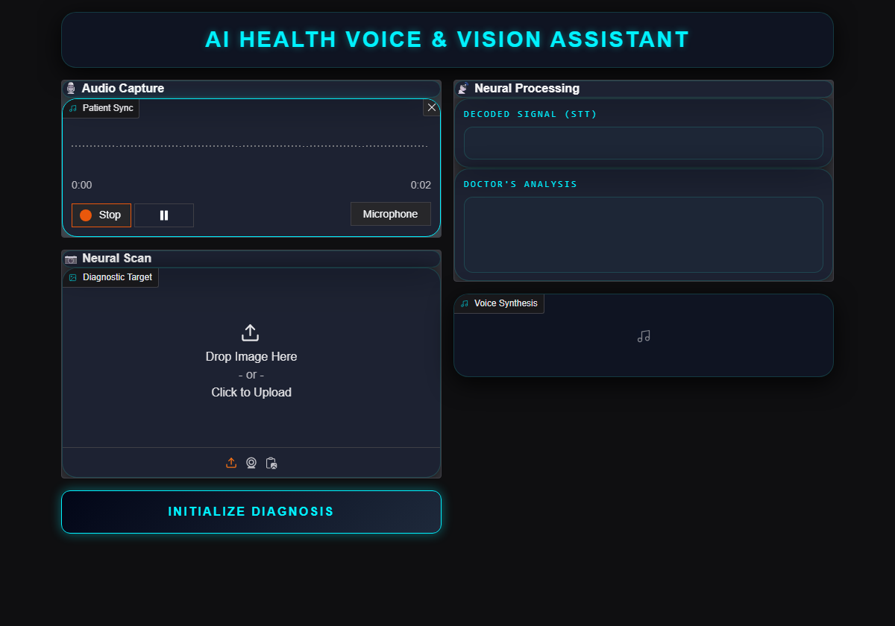
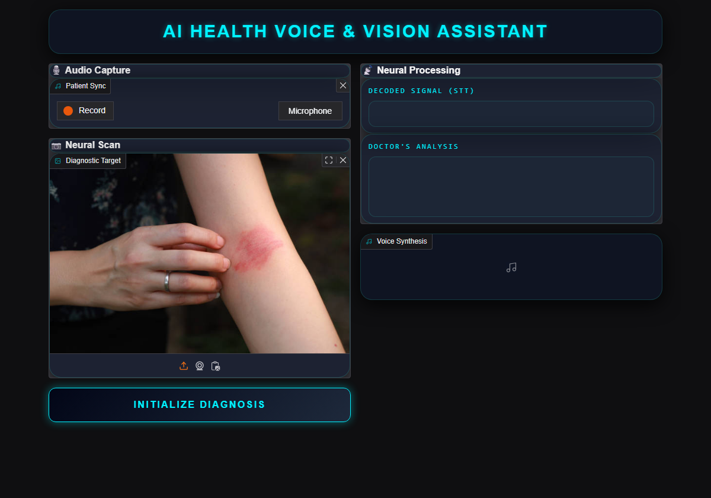
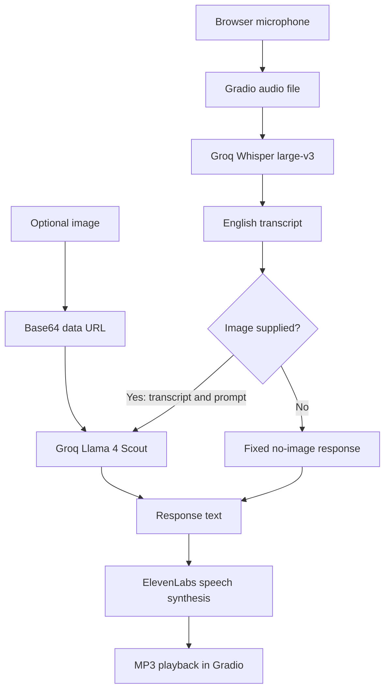

<div align="center">
  <h1>AI Medical Voice &amp; Vision Assistant</h1>
  <p>A local Gradio prototype for developers exploring medical voice and image workflows: a spoken question and optional image become a transcript, response, and spoken playback.</p>
  <p>
    
    
    
    
    
  </p>
  
  <p><em>Recorded voice and image inputs ready for processing in the current interface.</em></p>
  <p><a href="#-demo--screenshots">Demo</a> | <a href="ai-doctor-2.0-voice-and-vision-main/README.md">Docs</a> | <a href="#-architecture">Architecture</a> | <a href="#-getting-started">Quickstart</a></p>
</div>

<details>
<summary>Table of contents</summary>

- [Problem and Solution](#-problem-and-solution)
- [Key Features](#-key-features)
- [Demo / Screenshots](#-demo--screenshots)
- [Architecture](#-architecture)
- [Tech Stack](#-tech-stack)
- [Engineering Highlights](#-engineering-highlights)
- [Getting Started](#-getting-started)
- [Project Structure](#-project-structure)
- [Roadmap](#-roadmap)
- [Author](#-author)

</details>

## 🎯 Problem and Solution

Combining a spoken medical question with an image requires transcription, multimodal inference, and speech synthesis to share one request flow.
This learning project connects those stages in a Gradio interface: Groq Whisper transcribes the question, Llama 4 Scout processes it with an image, and ElevenLabs reads the response aloud.
It is a local demonstration without clinical validation or independently verified diagnoses; it does not retain conversation history.

## ✨ Key Features

- **Browser voice capture:** Record microphone audio in Gradio, then transcribe it with Groq-hosted `whisper-large-v3` to supply text to the vision workflow.
- **Image-conditioned responses:** Combine the transcript, prompt, and uploaded image with `meta-llama/llama-4-scout-17b-16e-instruct` so the response can use both inputs.
- **Spoken output:** Synthesize responses with ElevenLabs `eleven_turbo_v2` and the `Aria` voice, returning an MP3 for playback alongside the text.
- **Input preview:** Review the captured audio and uploaded image before submission; the image input accepts different visual cases.
- **Required audio validation:** Reject an empty audio input before any external service call, keeping incomplete submissions out of the inference flow.
- **Deterministic no-image behavior:** Return and synthesize a fixed no-image message when no image is supplied, bypassing the vision model.

| Voice capture | Image input |
| --- | --- |
|  |  |
| Review a recorded question before submission. | Preview a scalp image in the same image component. |

## 📸 Demo / Screenshots

<p align="center">
  
</p>

*An archived local run displayed in the current interface. The transcript and response are the exact saved values; only the read-only text areas were expanded for legibility. This screenshot does not represent a new model call.*

| Interface overview | Microphone capture | Skin image input |
| --- | --- | --- |
|  |  |  |
| Initial input and output layout. | Capture a spoken question. | Preview an uploaded skin image. |

[View all seven screenshots](ai-doctor-2.0-voice-and-vision-main/portfolio-images/).

## 🏗️ Architecture



- `gradio_app.py` owns the UI, custom CSS, response prompt, validation, and orchestration; it receives audio and image file paths from Gradio.
- `voice_of_the_patient.py` sends the audio file to Groq for English transcription and also contains a separate local recording helper.
- `brain_of_the_doctor.py` Base64-encodes the image and sends it with the transcript and prompt; the optional-image branch avoids this call when no image is present.
- `voice_of_the_doctor.py` requests speech synthesis and returns a file path; Gradio displays the transcript, response, and playable MP3.
- The workflow depends on external APIs and uses a fixed `final.mp3` output path; simultaneous requests may overwrite one another's audio.

## 🧰 Tech Stack

| Layer | Technology | Purpose |
| --- | --- | --- |
| Frontend | Gradio 5.12.0 Blocks, custom CSS | Browser microphone capture, image upload, text output, and audio playback. |
| Backend | Python 3.11 | UI callback and separate transcription, vision, and synthesis modules. |
| Backend | SpeechRecognition, pydub, PyAudio, gTTS | Separate local recording and gTTS helpers; gTTS is unused by the Gradio workflow. |
| AI / ML | Groq SDK, Whisper `whisper-large-v3` | Hosted English speech transcription. |
| AI / ML | Groq SDK, `meta-llama/llama-4-scout-17b-16e-instruct` | Transcript- and image-conditioned response generation. |
| AI / ML | ElevenLabs SDK, `eleven_turbo_v2`, `Aria` | Response speech synthesis used by the Gradio workflow. |
| Data | File paths, Base64 data URLs, MP3 | Input handoff, image transport, and playable output; no persistence layer. |
| DevOps | `requirements.txt`, `Pipfile`, `Pipfile.lock` | Dependency specifications and lockfile; `Pipfile` declares Python 3.11. |

## ⚙️ Engineering Highlights

- **Integration boundaries:** Multiple model services require distinct inputs and outputs → the UI delegates transcription, image analysis, and speech synthesis to separate modules → the main request path remains easy to follow.
- **File handoff:** Browser recordings and synthesized speech must reach the UI → Gradio supplies input paths and the TTS helper returns an MP3 path → playback consumes the returned file directly.
- **Input branching:** Audio is required while an image is optional → validate audio before external calls and use a fixed no-image response → incomplete audio submissions are rejected and the no-image path skips vision inference.

**Current limits:** No authentication, automated test suite, clinical validation, or production data-handling policy is provided. Audio, images, and response text are sent to external services; use this as a local demonstration and avoid identifiable patient data.

**Image format caveat:** The vision helper labels every image data URL as JPEG regardless of the file's actual format. The UI can display other formats, but their model behavior has not been verified.

## 🚀 Getting Started

### Prerequisites

- Python 3.11 and a browser with microphone access.
- A Groq API key for transcription and image analysis.
- An ElevenLabs API key for synthesized speech.
- Network access for the external API calls.

### Install

Clone the repository and enter the application directory:

```bash
git clone https://github.com/vinayak533/AI-Medical-Voice-Vision-Assistant.git
cd AI-Medical-Voice-Vision-Assistant/ai-doctor-2.0-voice-and-vision-main
python --version  # Confirm Python 3.11
```

Create a virtual environment and install the dependencies from `requirements.txt`:

```bash
python -m venv .venv
# macOS/Linux: source .venv/bin/activate
# Windows PowerShell: .\.venv\Scripts\Activate.ps1
python -m pip install -r requirements.txt
```

`PyAudio` supports the separate local recording helper and may require PortAudio build dependencies on some systems. The Gradio UI records through the browser.

### Configure

Create a `.env` file in the application directory and set these variables to your own credentials:

- `GROQ_API_KEY`
- `ELEVEN_API_KEY`

The ElevenLabs variable is named `ELEVEN_API_KEY` in the code. `.env` is excluded by `.gitignore`; keep API keys and patient data out of commits.

### Run

```bash
python gradio_app.py
```

Open the local URL printed by Gradio, usually `http://127.0.0.1:7860`. Record a question, optionally add an image, and select **INITIALIZE DIAGNOSIS**.
The application entry point is `gradio_app.py`; there is no `app.py` entry point.

## 📂 Project Structure

```text
AI-Medical-Voice-Vision-Assistant/
├── README.md                              # Repository overview
└── ai-doctor-2.0-voice-and-vision-main/     # Application and dependencies
    ├── gradio_app.py                      # UI, prompt, validation, and callback
    ├── brain_of_the_doctor.py             # Image encoding and vision request
    ├── voice_of_the_patient.py            # Transcription and local recording helper
    ├── voice_of_the_doctor.py             # ElevenLabs synthesis and gTTS helpers
    ├── requirements.txt                  # pip dependency specifications
    ├── Pipfile / Pipfile.lock             # Python version and dependency lockfile
    ├── portfolio-images/                 # Seven screenshots
    └── *.jpg, *.webp                      # Sample images
```

## 🗺️ Roadmap

The following next steps address the documented limitations and contribution priorities:

- [x] Connect voice capture, transcription, optional image analysis, and speech playback in one interface.
- [ ] Add automated coverage for input validation and the image/no-image branches.
- [ ] Replace the fixed `final.mp3` path with output handling that isolates concurrent requests.
- [ ] Match image data URL MIME types to uploaded formats and verify their model behavior.
- [ ] Improve accessibility and error reporting.

Issues and pull requests are welcome. Keep changes focused on the existing workflow and document new external services or environment variables.
Before opening a pull request, exercise microphone capture, image upload, the no-image path, and playback locally; add tests for new logic where practical. No test suite is configured today.

## 👤 Author

**Vinayak K V** · AI/ML Engineer at AMnova Technologies

[GitHub](https://github.com/vinayak533) · [LinkedIn](https://linkedin.com/in/vinayak-kv-ds) · [Email](mailto:vinayakkvjob@gmail.com)

Building production multi-agent AI systems. Open to technical discussions and collaboration.
